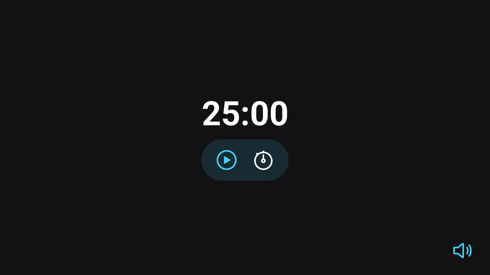

<h1> FocusTimer </h1>

 

<h2> O Projeto </h2>

O projeto foi desenvolvido durante as aulas do curso Explorer da Rocketseat.  

Ele consiste em um temporizador para foco, onde o usuário pode definir o tempo de estudo. O projeto também conta com uma música lo-fi para relaxamento e foco que pode ser ligada ou desligada. 

  

 

informações básicas que o usuário deve seguir para usar o FocusTimer:
  
  - Clicar no relógio para definir o tempo
    - Aparecerá um popup para inserir o tempo
    - Para sair do popup clicar em ok ou apertar ESC no teclado
  - Clicar no botão play para iniciar a contagem
  - clicar no botão pause para pausar a contagem
  - clicar no botão stop para parar e redefinir a contagem
  - clicar no botão de som para ligar ou desligar a música

 

Quer conferir o FocusTimer ? 

[Visite o projeto online](https://eltonprado.github.io/Projeto12_CalculadoraIMC/)

 

<h2> O intuito do projeto </h2>

O intuito do projeto foi colocar em prática os conhecimentos acerca de:

- HTML
- CSS
- JavaScript
  - Variáveis
  - Utilização de DOM
  - Manipulação de eventos e callbacks
  - ES6 modules
  - Refatoração e Clean Code

 

<h2> Tecnologias </h2>

Foi utilizado as seguintes tecnologias para desenvolver esse projeto:

- HTML
- CSS
- JavaScript
- Git
- GitHub